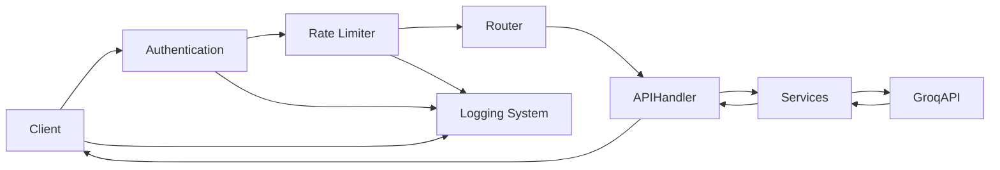

# AI Tool Nest - Architecture Documentation

## System Overview

AI Tool Nest is a modern REST API service built with FastAPI, focusing on providing AI-powered text processing capabilities. The application follows a clean, modular architecture designed for scalability and maintainability, with robust authentication mechanisms.

## Core Architecture Components

### 1. Application Layer (`app/`)
The application is organized into distinct modules, each with specific responsibilities:

```
app/
├── api/            # API endpoints and versioning
│   └── v1/         # Version 1 endpoints
│       └── endpoints/
│           ├── text_summarizer.py  # Text processing endpoints
│           ├── auth.py            # Authentication endpoints
│           └── api_keys.py        # API key management
├── core/           # Core configuration and utilities
│   ├── config.py   # Application configuration
│   ├── security.py  # Authentication and security
│   ├── logging_config.py  # Logging configuration
│   └── rate_limit.py     # Rate limiting configuration
├── models/         # Database models
│   ├── user.py     # User model
│   └── api_key.py  # API key model
├── schemas/        # Pydantic models for data validation
└── services/       # Business logic and AI integration
    ├── text_summarizer.py  # Text processing service
    └── api_key_service.py  # API key management service
```

### 2. Component Relationships

#### Authentication Layer
- **JWT Authentication**
  - User registration and login
  - Token generation and validation
  - Password hashing and verification
  - Token expiration management

- **API Key Authentication**
  - Key generation and management
  - Key hashing and validation
  - Comprehensive usage tracking
    - Request metrics collection
    - Performance monitoring
    - Usage analytics
    - Access patterns analysis
  - Key revocation system

#### API Layer
- **API Endpoints** (`app/api/v1/endpoints/`)
  - Versioned REST endpoints
  - Request/Response handling
  - Input validation
  - Error handling
  - API documentation via Swagger/ReDoc
  - Rate limiting per endpoint
  - Authentication requirements
  - Request logging

#### Service Layer
- **AI Services** (`app/services/`)
  - Text processing logic
  - Groq API integration
  - Async request handling
  - Error handling and retries
  - Operation logging

#### Core Layer
- **Core** (`app/core/`)
  - Application configuration
  - Environment settings
  - Security configuration
  - Authentication utilities
  - API client setup
  - Logging system
  - Rate limiting system

#### Schema Layer
- **Schemas** (`app/schemas/`)
  - Pydantic models for validation
  - Request/Response schemas
  - Data transformation
  - Authentication schemas

### 3. Authentication Flow

1. **JWT Authentication Flow**
   ```mermaid
   graph LR
       Client --> Login[Login Request]
       Login --> Validate[Validate Credentials]
       Validate --> Generate[Generate JWT]
       Generate --> Client[Return Token]
       Client --> Protected[Access Protected Route]
       Protected --> ValidateToken[Validate JWT]
       ValidateToken --> Allow[Allow Access]
   ```

2. **API Key Authentication Flow**
   ```mermaid
   graph LR
       User --> CreateKey[Create API Key]
       CreateKey --> Hash[Hash Key]
       Hash --> Store[Store in DB]
       Store --> Return[Return Key to User]
       Client --> UseKey[Use API Key]
       UseKey --> Validate[Validate Key]
       Validate --> Track[Track Usage]
       Track --> Allow[Allow Access]
       Track --> Stats[Update Statistics]
   ```

### 4. Request Flow

1. **HTTP Request** → FastAPI Router
2. **Authentication** → JWT Token or API Key Validation
3. **Rate Limit Check** → Allow/Deny Request
4. **Router** → API Handler
5. **Handler** → Service Layer
6. **Service Layer** → AI Processing
7. **Response** → Client
8. **Logging** → File & Console Output

### 5. Data Flow



## Key Design Decisions

### 1. Dual Authentication System
- JWT tokens for interactive users
- API keys for programmatic access
- Secure key storage with hashing
- Usage tracking and analytics
- Key revocation capability

### 2. API-First Design
- Clean REST API endpoints
- OpenAPI documentation
- Version control for endpoints
- Consistent response formats
- Rate limiting for fair usage
- Comprehensive request logging

### 3. Dependency Management
- UV for package management
- Lock file for reproducible builds
- Fast dependency resolution
- Virtual environment isolation

### 4. Configuration Management
- Environment-based settings
- Pydantic settings validation
- Secure key management
- Centralized configuration
- Logging configuration
- Rate limit settings

### 5. AI Integration
- Async request handling
- Error handling and retries
- Response validation
- Configurable AI models

## Security Architecture

1. **Authentication**
   - JWT token authentication
   - API key authentication
   - Password hashing with bcrypt
   - Secure key generation
   - Key usage tracking
   - Token expiration
   - Key revocation

2. **Environment Variables**
   - Sensitive data stored in `.env`
   - Configuration validation
   - API key management
   - Secure key rotation

3. **API Security**
   - Input validation via Pydantic
   - Request/Response schemas
   - Rate limiting per endpoint
   - Error handling
   - Request logging
   - Security event logging

4. **Dependency Security**
   - Regular security audits
   - Lock file validation
   - Dependency updates
   - Version pinning

## Scalability Considerations

1. **Modular Design**
   - Independent components
   - Easy to extend functionality
   - Clear separation of concerns
   - Pluggable services
   - Configurable rate limits
   - Structured logging

2. **Async Processing**
   - Async request handling
   - Concurrent AI processing
   - Connection pooling
   - Resource management
   - Rate limit tracking

3. **API Versioning**
   - Support for multiple API versions
   - Backward compatibility
   - Clear deprecation path
   - Version documentation

## Development Workflow

1. **Local Development**
   - UV for dependency management
   - Hot reload support
   - Debug configuration
   - Development tools
   - Local logging
   - Rate limit testing

2. **Testing**
   - Unit test structure
   - Integration test support
   - Mock AI responses
   - Test fixtures
   - Rate limit testing
   - Log verification

3. **Deployment**
   - Production configuration
   - Environment management
   - Dependency handling
   - Security checks
   - Log rotation
   - Rate limit monitoring

## Future Considerations

1. **Authentication Enhancements**
   - OAuth2 provider integration
   - Social authentication
   - Multi-factor authentication
   - Token refresh mechanism
   - Token blacklisting
   - Enhanced API key analytics
     - Usage dashboards
     - Rate limit optimization
     - Usage pattern detection
     - Anomaly detection
     - Cost tracking
     - Usage forecasting

2. **Caching Layer**
   - Response caching
   - AI model caching
   - Rate limit optimization
   - Cache invalidation

3. **Monitoring**
   - Application metrics
   - Error tracking
   - Performance monitoring
   - AI service monitoring
   - Rate limit analytics
   - Log aggregation
   - Authentication analytics 